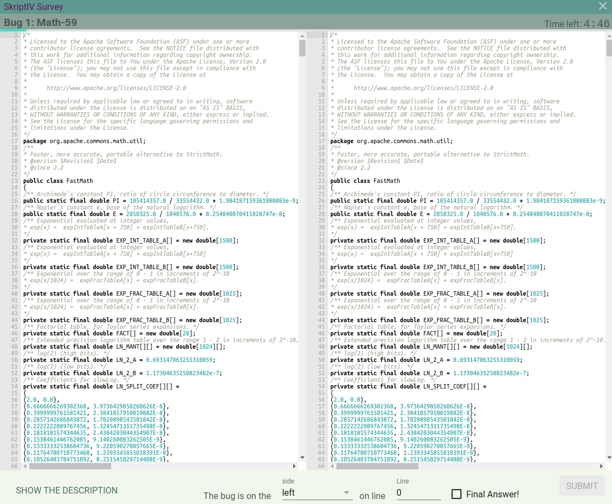

SkriptIV -- Version 1
=====================

`SkriptIV` (pronounced *script-four*) is a software system designed to facilitate
research concerning the nature of program source code. This repository
contains the initial release of the `SkriptIV` system as described in my senior thesis research,
[An Empirical Study on the Effects of Code Formatting on Manual Code Proofreading](Thesis.pdf).

Please read the thesis document to learn more about this research and the
`SkriptIV` tool.

Here are some screenshots to give you an idea of what this tool is all about:


The database input page.


The pre-test survey.


The screen which is seen before starting a question


The testing interface actually displaying a question.

### Building and running

To build the `SkriptIV` system, you'll need Node.JS, bower, and Electron.
You can do the following in your terminal to install dependencies with
Node and Bower, and the last line starts up `SkriptIV`.

```bash
$ cd Skriptiv       # You need to be in the Skriptiv directory
$ npm install
$ bower install
$ electron .        # or "npm start"
```

### About the Defects Directory

Also included in this repository is a copy of the data files necessary to run
the exact experiment described in my thesis. This is the `Defects-Sources`
directory. An important note about software licencing: the SkriptIV data files
(all of the `*.json` files) are released under the MIT license along with
`SkriptIV` itself, however, both the original source files from the open-source
projects, and the derivative source which is the same source but modified with
different code formatting, are released under the ***original source licence***
for the project that the source came from. So, for example, the `.json` file inside
of the `Chart-8` directory is MIT Licensed because it is a SkriptIV data file.
However, the source code inside that directory (the `.java` files) are not.
They retain the source project's the original licensing (included as a separate
`LICENSE` file in each separate directory.)